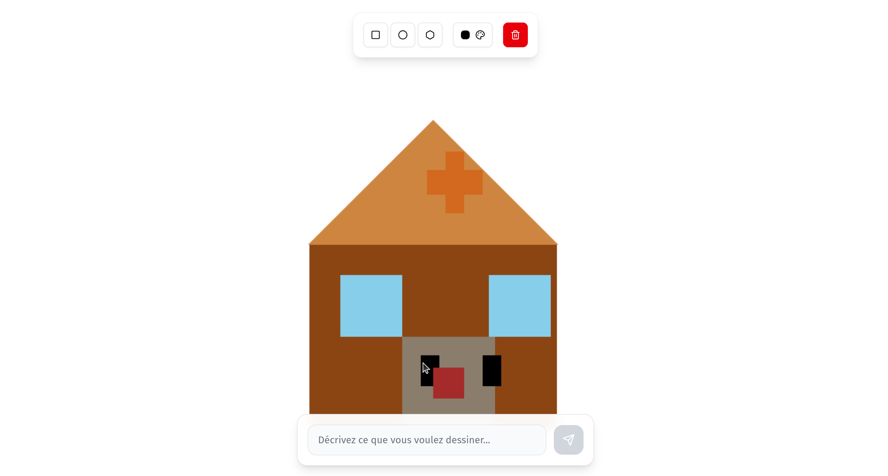

# 🎨 Draw Assistant

**Draw Assistant** est une application web qui permet de dessiner sur un canvas avec des outils simples (rectangle, cercle, polygone) et d’interagir avec une IA pour enrichir automatiquement vos créations.

🚀 Démo en ligne : [draw.adrienmoreau.fr](https://draw.adrienmoreau.fr)
*(si le serveur renvoie des erreurs, c’est probablement dû à l’absence de crédits sur le token API Mistral — réessayez plus tard)*

---

## Fonctionnalités

*    **Outils de dessin** : Rectangle, Cercle, Polygone
* 💬 **Prompt bar** : Interagissez avec l’IA pour modifier votre canvas
* 📸 **Exemples illustrés** :

---

## Exemple

  * Exemple : *“Dessine une maison”*
    
  * Exemple : *“Ajoute une cheminée à la maison”*
    

---

## Installation & Self-hosting

Vous pouvez héberger **Draw Assistant** sur votre machine avec Docker :

```bash
# Cloner le dépôt
git clone https://github.com/moreauadrien/draw-assistant
cd draw-assistant

# Construire l’image Docker
docker build -t draw-assistant .

# Lancer le conteneur
docker run -p 8000:8000 -e MISTRAL_TOKEN=ton_token draw-assistant
```

L’application sera accessible sur [http://localhost:8000](http://localhost:8000).

---
